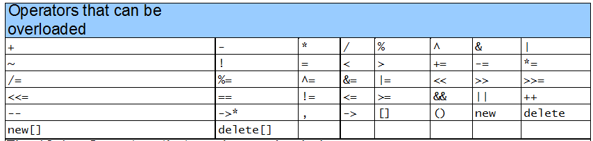
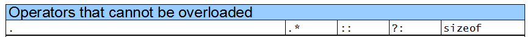

# C++ NOTE

## CONTENT
- [Override and Overload](#override-and-overload)
- [Class member](#class-member)
- [Pointer](#pointer)
- [Friend Function and Friend class](#friend-function-and-friend-class)
- [Pass by reference and value](#pass-by-reference-and-value)

## Override and Overload
Overloading function name means providing more than one declaration and definition using the same function name.

Overriding means

## Class member
### Accessor and Mutator function
Corresponding to get and set function.
### Utility Function(helper function)
The private function in the class which is used only in the class.

## Pointer
### New and delete
In C, we allocate and collect memory by using:
```c
int *p;
p = (int*)malloc(sizeof(int));
*p = 23;
free(p);
```
Using malloc is returning a block of size bytes of memory. Note this method will only return the memory but not perform object initialization and destruction.

New and delete are dynamic allocation operators.
```c++
int *p1;
int *p2;
p1 = new int;//new a single object
p2 = new int[5]; //new a array
delete p1;
delete []p2; //call the destruction of every elements.

t *p3;
p3 = new t(val); //new a object and initialize it
```
### This
Every object in C++ has access to its own address through **this** pointers. We always use it when we want to specify which parameters we refer to.
```c++
//Example 1
void Data::set(int year, int month, int day){
  /*pass the value of parameter month to its own private parameter month.*/
  this->month = month;  
  this->year = year;
  this->day = day;
}
//Example 2
Data& Data::set(int year){
  this->year = year;
  //this is a pointer, therefore * this is a reference of the object
  return * this;
}
```
## Friend Function and Friend Class
Friend functions are not members of a class, but can access private member variables of the class. It is declared using the keyword **friend** in the class definition.
```c++
//Example one friend function
class dayOfYear{
public:
  friend bool equal(dayOfYear date1, dayOfYear data2);
};

bool equal(dayOfYear date1, dayOfYear date2){};

//Example two friend Class
class y;
class x{
public:
  friend y;
private:
  int k;
  void m_xfunc();
};

void y::m_yfunc(x& obj){
//y can access to the private members in x class
//since its a friend class of x
  obj.k = 100;
}

//Example three friend function from other Class
class y{
public:
  void yfunc();
};

class x{
public:
  friend void y::func();
private:
  int k;
  void xfunc();
};

void y::yfunc(){
  x obj;
  obj.k = 100;
}//;
```
**When to use a friend function:**
Use a friend function if the task performed by the function involves more than one object.

## Pass by reference and value
Pass by reference is more efficient as there is only one copy of the argument. Pass by value results in two copies of the arguments.

We can use const declaration to ensure that the called function will not modify the argument.
### const
```c++
//1. set the parameters as const and it will not modify by called function
Money add(const Money& amount1){};

//2. set the function as const so that the function will not change the value of any member variables
int getMonth() const;
int getMonth() const{};
//const keyword should in function declaration and definition.

//3. const data member must be initialized using a member initializer
class Increment{
public:
  Increment(int c,int in);
private:
  int count;
  const int increment;
};
//member initializer
Increment::Increment(int c, int i):count(c),increment(in){};
```

## Operators Overloading


**Overload a operator in a Class**
```c++
ReturnType ClassName::operator symbol(arguments){};
```
### Unary Operators
Overload ++ and --
Prefix version overloaded the same as any other prefix unary operators. is
```c++
//prefix
d1.operator++(); //for ++d1;
//postfix
d1.operator++(int);
//prototype:
Date::operator++(int);
```
### Binary operators
重载二元运算符时，成员运算符函数只需显式传递一个参数（即二元运算符的右操作数），而左操作数则是该类对象本身，通过this指针隐式传递:
```c++
complex c1(1,2),c2(2); //instantiate a complex number.
complex c3;
c3 = c1 + c2; //c1.operator + (c2)
```
可以在类中实现overload也可以使用友元函数，但是在类中实现意味着只需要传递一个参数即可，而如果是使用友元函数则需要两个参数。在实际案例中，使用友元函数较好。
注意-运算既是Unary Operator(x = -y //negate a value) 也是Binary Operator(x = y - z;).
